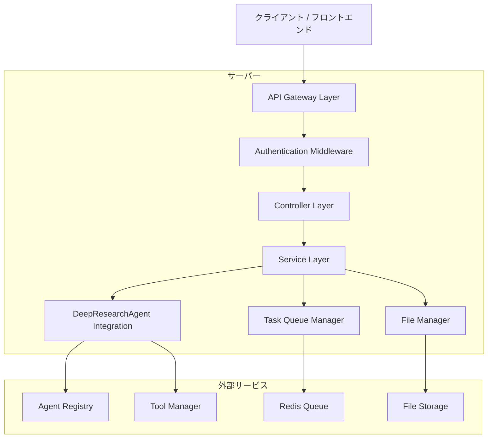
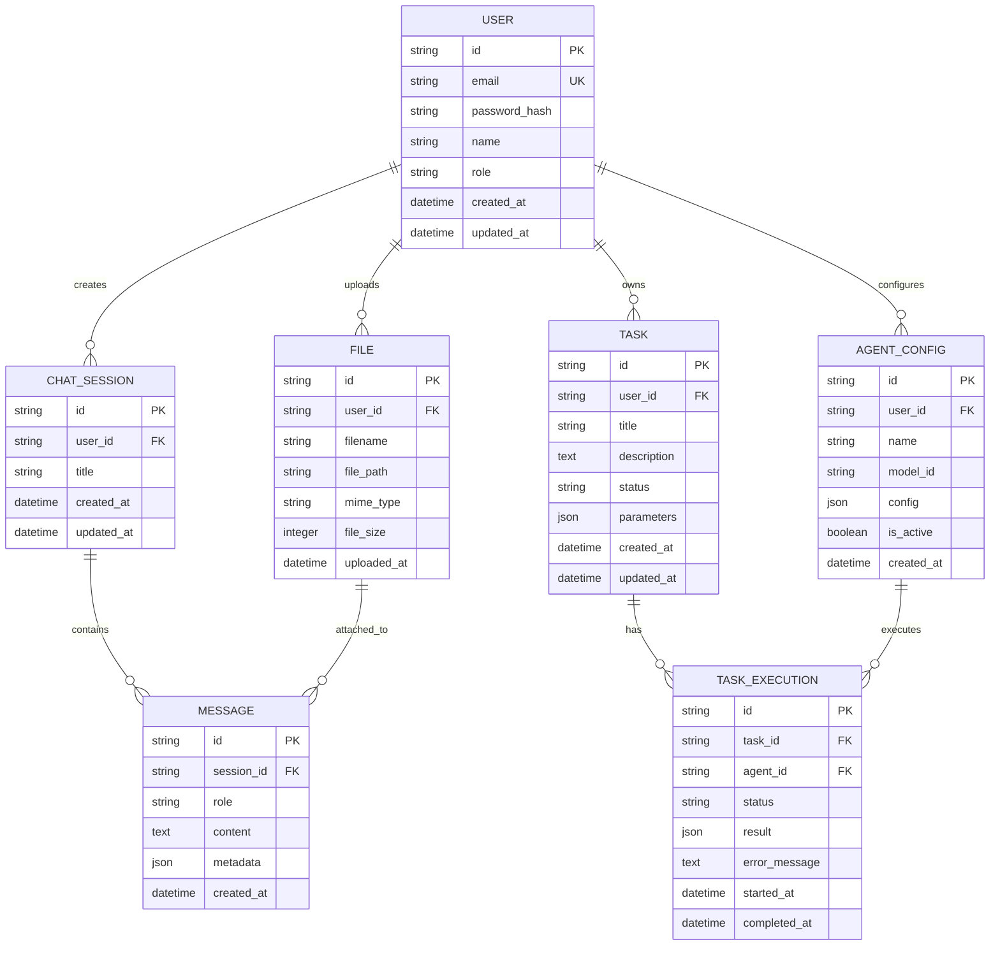

# DeepResearchAgent WebUI - 技術アーキテクチャドキュメント

## 1. アーキテクチャ設計

```mermaid
graph TD
    A[ユーザーブラウザ] --> B[React Frontend Application]
    B --> C[WebSocket Connection]
    B --> D[REST API Client]
    D --> E[FastAPI Backend Server]
    C --> E
    E --> F[DeepResearchAgent Framework]
    E --> G[File Storage System]
    E --> H[Task Queue (Redis)]
    F --> I[Multiple AI Models]
    F --> J[Tool Integrations]
    
    subgraph "フロントエンド層"
        B
    end
    
    subgraph "バックエンド層"
        E
        H
    end
    
    subgraph "エージェント層"
        F
        I
        J
    end
    
    subgraph "ストレージ層"
        G
    end
```

## 2. 技術スタック

- **フロントエンド**: React@18 + TypeScript@5 + Vite@5 + TailwindCSS@3
- **状態管理**: Zustand + React Query (TanStack Query)
- **UI コンポーネント**: Radix UI + Headless UI + Framer Motion
- **バックエンド**: FastAPI@0.104 + Python@3.11
- **リアルタイム通信**: WebSocket (Socket.IO)
- **タスクキュー**: Redis + Celery
- **ファイルストレージ**: ローカルファイルシステム + MinIO (オプション)

## 3. ルート定義

| ルート | 目的 |
|--------|------|
| / | ダッシュボード、システム概要とクイックアクション |
| /chat | チャットインターフェース、メインの対話画面 |
| /agents | エージェント管理、設定とパフォーマンス監視 |
| /tasks | タスク管理、作成・実行・監視・履歴 |
| /files | ファイル管理、アップロード・整理・プレビュー |
| /tools | ツール統合、Python実行・画像生成・ブラウザ自動化 |
| /settings | 設定・プロファイル、ユーザー設定とAPIキー管理 |
| /login | ログインページ、認証とセッション管理 |
| /register | 登録ページ、新規ユーザー作成 |

## 4. API定義

### 4.1 コアAPI

**認証関連**
```
POST /api/auth/login
```

リクエスト:
| パラメータ名 | パラメータ型 | 必須 | 説明 |
|-------------|-------------|------|------|
| email | string | true | ユーザーのメールアドレス |
| password | string | true | パスワード |

レスポンス:
| パラメータ名 | パラメータ型 | 説明 |
|-------------|-------------|------|
| success | boolean | 認証成功フラグ |
| token | string | JWTアクセストークン |
| user | object | ユーザー情報 |

**エージェント管理**
```
GET /api/agents
POST /api/agents
PUT /api/agents/{agent_id}
DELETE /api/agents/{agent_id}
```

**チャット機能**
```
POST /api/chat/send
GET /api/chat/history
WS /ws/chat/{session_id}
```

**タスク管理**
```
GET /api/tasks
POST /api/tasks
GET /api/tasks/{task_id}
PUT /api/tasks/{task_id}
DELETE /api/tasks/{task_id}
POST /api/tasks/{task_id}/execute
```

**ファイル管理**
```
POST /api/files/upload
GET /api/files
GET /api/files/{file_id}
DELETE /api/files/{file_id}
```

**ツール統合**
```
POST /api/tools/python/execute
POST /api/tools/image/generate
POST /api/tools/video/generate
POST /api/tools/browser/automate
```

例:
```json
{
  "email": "user@example.com",
  "password": "securepassword123"
}
```

## 5. サーバーアーキテクチャ図



## 6. データモデル

### 6.1 データモデル定義



### 6.2 データ定義言語

**ユーザーテーブル (users)**
```sql
-- テーブル作成
CREATE TABLE users (
    id VARCHAR(36) PRIMARY KEY DEFAULT (UUID()),
    email VARCHAR(255) UNIQUE NOT NULL,
    password_hash VARCHAR(255) NOT NULL,
    name VARCHAR(100) NOT NULL,
    role VARCHAR(20) DEFAULT 'user' CHECK (role IN ('user', 'researcher', 'admin')),
    created_at TIMESTAMP DEFAULT CURRENT_TIMESTAMP,
    updated_at TIMESTAMP DEFAULT CURRENT_TIMESTAMP ON UPDATE CURRENT_TIMESTAMP
);

-- インデックス作成
CREATE INDEX idx_users_email ON users(email);
CREATE INDEX idx_users_role ON users(role);
```

**チャットセッションテーブル (chat_sessions)**
```sql
CREATE TABLE chat_sessions (
    id VARCHAR(36) PRIMARY KEY DEFAULT (UUID()),
    user_id VARCHAR(36) NOT NULL,
    title VARCHAR(255) NOT NULL,
    created_at TIMESTAMP DEFAULT CURRENT_TIMESTAMP,
    updated_at TIMESTAMP DEFAULT CURRENT_TIMESTAMP ON UPDATE CURRENT_TIMESTAMP,
    FOREIGN KEY (user_id) REFERENCES users(id) ON DELETE CASCADE
);

CREATE INDEX idx_chat_sessions_user_id ON chat_sessions(user_id);
CREATE INDEX idx_chat_sessions_created_at ON chat_sessions(created_at DESC);
```

**メッセージテーブル (messages)**
```sql
CREATE TABLE messages (
    id VARCHAR(36) PRIMARY KEY DEFAULT (UUID()),
    session_id VARCHAR(36) NOT NULL,
    role VARCHAR(20) NOT NULL CHECK (role IN ('user', 'assistant', 'system')),
    content TEXT NOT NULL,
    metadata JSON,
    created_at TIMESTAMP DEFAULT CURRENT_TIMESTAMP,
    FOREIGN KEY (session_id) REFERENCES chat_sessions(id) ON DELETE CASCADE
);

CREATE INDEX idx_messages_session_id ON messages(session_id);
CREATE INDEX idx_messages_created_at ON messages(created_at DESC);
```

**エージェント設定テーブル (agent_configs)**
```sql
CREATE TABLE agent_configs (
    id VARCHAR(36) PRIMARY KEY DEFAULT (UUID()),
    user_id VARCHAR(36) NOT NULL,
    name VARCHAR(100) NOT NULL,
    model_id VARCHAR(100) NOT NULL,
    config JSON NOT NULL,
    is_active BOOLEAN DEFAULT TRUE,
    created_at TIMESTAMP DEFAULT CURRENT_TIMESTAMP,
    FOREIGN KEY (user_id) REFERENCES users(id) ON DELETE CASCADE
);

CREATE INDEX idx_agent_configs_user_id ON agent_configs(user_id);
CREATE INDEX idx_agent_configs_is_active ON agent_configs(is_active);
```

**タスクテーブル (tasks)**
```sql
CREATE TABLE tasks (
    id VARCHAR(36) PRIMARY KEY DEFAULT (UUID()),
    user_id VARCHAR(36) NOT NULL,
    title VARCHAR(255) NOT NULL,
    description TEXT,
    status VARCHAR(20) DEFAULT 'pending' CHECK (status IN ('pending', 'running', 'completed', 'failed')),
    parameters JSON,
    created_at TIMESTAMP DEFAULT CURRENT_TIMESTAMP,
    updated_at TIMESTAMP DEFAULT CURRENT_TIMESTAMP ON UPDATE CURRENT_TIMESTAMP,
    FOREIGN KEY (user_id) REFERENCES users(id) ON DELETE CASCADE
);

CREATE INDEX idx_tasks_user_id ON tasks(user_id);
CREATE INDEX idx_tasks_status ON tasks(status);
CREATE INDEX idx_tasks_created_at ON tasks(created_at DESC);
```

**ファイルテーブル (files)**
```sql
CREATE TABLE files (
    id VARCHAR(36) PRIMARY KEY DEFAULT (UUID()),
    user_id VARCHAR(36) NOT NULL,
    filename VARCHAR(255) NOT NULL,
    file_path VARCHAR(500) NOT NULL,
    mime_type VARCHAR(100),
    file_size INTEGER,
    uploaded_at TIMESTAMP DEFAULT CURRENT_TIMESTAMP,
    FOREIGN KEY (user_id) REFERENCES users(id) ON DELETE CASCADE
);

CREATE INDEX idx_files_user_id ON files(user_id);
CREATE INDEX idx_files_uploaded_at ON files(uploaded_at DESC);
```

**初期データ**
```sql
-- 管理者ユーザー作成
INSERT INTO users (email, password_hash, name, role) VALUES 
('admin@deepresearch.ai', '$2b$12$example_hash', 'System Administrator', 'admin');

-- デフォルトエージェント設定
INSERT INTO agent_configs (user_id, name, model_id, config) VALUES 
((SELECT id FROM users WHERE email = 'admin@deepresearch.ai'), 'General Agent', 'gpt-4o', '{"max_steps": 20, "tools": ["python_interpreter_tool", "image_generator_tool"]}');
