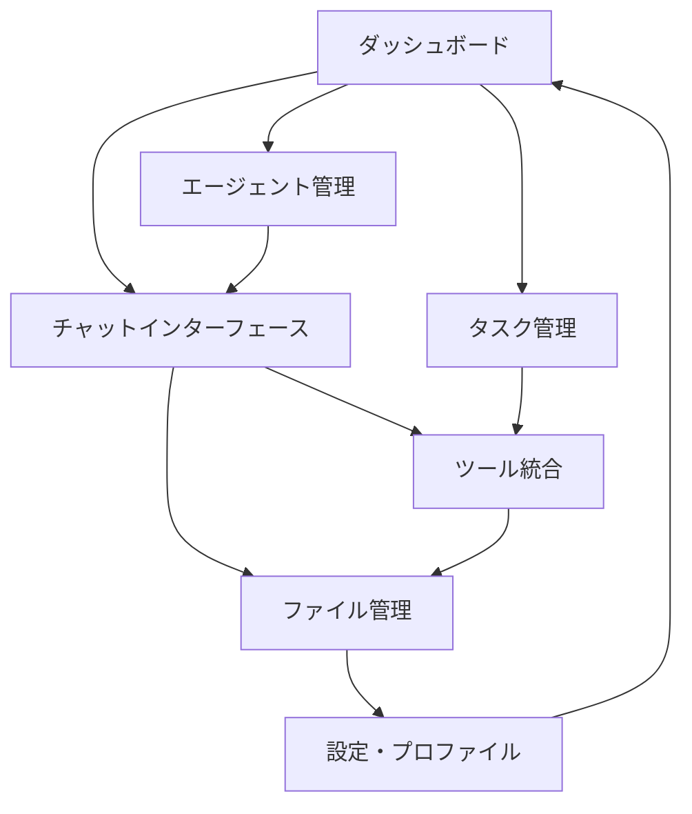

# DeepResearchAgent WebUI - 製品要件定義書

## 1. 製品概要

DeepResearchAgent WebUIは、既存のDeepResearchAgentフレームワークを最大限活用する本格的なWebベースのユーザーインターフェースです。GensparkのSuperAgent、Skywork、Manusのような汎用型AIエージェントを目指し、研究者、開発者、一般ユーザーが複雑なタスクを効率的に実行できる統合プラットフォームを提供します。

既存のAPIキー設定を活用し、マルチエージェント協調、リアルタイム対話、高度なタスク管理機能を通じて、AI駆動の研究・開発ワークフローを革新します。

## 2. コア機能

### 2.1 ユーザーロール

| ロール | 登録方法 | 主要権限 |
|--------|----------|----------|
| 一般ユーザー | メール登録 | 基本的なエージェント機能、チャット、ファイルアップロード |
| 研究者 | 招待コード + 認証 | 高度な分析機能、カスタムエージェント作成、API統合 |
| 管理者 | システム管理者による設定 | 全機能アクセス、ユーザー管理、システム設定 |

### 2.2 機能モジュール

本WebUIは以下の主要ページで構成されます：

1. **ダッシュボード**: エージェント状態監視、タスク概要、クイックアクション、システム統計
2. **チャットインターフェース**: マルチエージェント対話、リアルタイムストリーミング、メッセージ履歴、ファイル共有
3. **エージェント管理**: エージェント選択・設定、カスタムエージェント作成、パフォーマンス監視
4. **タスク管理**: タスク作成・実行・監視、ワークフロー設計、結果管理、スケジューリング
5. **ファイル管理**: ファイルアップロード・管理、プレビュー機能、バージョン管理、共有設定
6. **ツール統合**: Python実行環境、画像・動画生成、ブラウザ自動化、外部API連携
7. **設定・プロファイル**: ユーザー設定、APIキー管理、通知設定、セキュリティ設定

### 2.3 ページ詳細

| ページ名 | モジュール名 | 機能説明 |
|----------|-------------|----------|
| ダッシュボード | システム概要 | エージェント状態、アクティブタスク数、システムリソース使用状況をリアルタイム表示 |
| ダッシュボード | クイックアクション | よく使用するタスクのワンクリック実行、テンプレート選択 |
| ダッシュボード | 最近のアクティビティ | 最新のタスク実行結果、エラーログ、通知一覧 |
| チャットインターフェース | メッセージ処理 | マークダウン対応、コードハイライト、ファイル添付、音声入力 |
| チャットインターフェース | エージェント選択 | 利用可能エージェント一覧、リアルタイム切り替え、マルチエージェント会話 |
| チャットインターフェース | ストリーミング応答 | リアルタイム応答表示、進行状況インジケーター、中断機能 |
| エージェント管理 | エージェント設定 | モデル選択、パラメータ調整、ツール設定、プロンプトカスタマイズ |
| エージェント管理 | パフォーマンス監視 | 応答時間、成功率、リソース使用量、コスト追跡 |
| エージェント管理 | カスタムエージェント | 新規エージェント作成、テンプレート管理、共有機能 |
| タスク管理 | タスク作成 | タスク定義、パラメータ設定、依存関係設定、優先度管理 |
| タスク管理 | 実行監視 | リアルタイム進行状況、ログ表示、エラーハンドリング |
| タスク管理 | 結果管理 | 結果表示、エクスポート機能、履歴管理、共有設定 |
| ファイル管理 | アップロード機能 | ドラッグ&ドロップ、複数ファイル対応、進行状況表示 |
| ファイル管理 | プレビュー機能 | 画像・動画・文書プレビュー、メタデータ表示 |
| ファイル管理 | 組織化機能 | フォルダ管理、タグ付け、検索機能、フィルタリング |
| ツール統合 | Python実行環境 | コードエディター、実行結果表示、パッケージ管理 |
| ツール統合 | 画像・動画生成 | プロンプト入力、生成パラメータ設定、結果プレビュー |
| ツール統合 | ブラウザ自動化 | ウェブスクレイピング設定、自動化スクリプト実行 |
| 設定・プロファイル | ユーザー設定 | プロファイル編集、テーマ設定、言語選択 |
| 設定・プロファイル | APIキー管理 | 各種APIキー設定、使用量監視、セキュリティ設定 |
| 設定・プロファイル | 通知設定 | タスク完了通知、エラー通知、メール設定 |

## 3. コアプロセス

### 一般ユーザーフロー
1. ユーザーがダッシュボードにアクセスし、システム状態を確認
2. チャットインターフェースで適切なエージェントを選択
3. 自然言語でタスクを入力し、必要に応じてファイルを添付
4. エージェントがタスクを解析し、必要なツールを自動選択
5. リアルタイムで実行進捗を監視し、結果を受け取り
6. 結果をファイル管理システムに保存し、必要に応じて共有

### 研究者フロー
1. カスタムエージェントを作成し、特定の研究タスクに最適化
2. 複雑なワークフローをタスク管理システムで設計
3. 複数のエージェントを協調させて大規模な研究プロジェクトを実行
4. Python実行環境で高度なデータ分析を実施
5. 結果を可視化し、レポートを自動生成

## 4. ユーザーインターフェース設計

### 4.1 デザインスタイル

- **プライマリカラー**: #3B82F6 (ブルー系) - 信頼性と技術的専門性を表現
- **セカンダリカラー**: #64748B (グレー系) - モダンで洗練された印象
- **アクセントカラー**: #10B981 (グリーン系) - 成功状態とポジティブなアクション
- **ボタンスタイル**: 角丸デザイン、ホバーエフェクト、マイクロインタラクション
- **フォント**: Inter (メイン)、JetBrains Mono (コード表示)
- **レイアウト**: カードベース、サイドバーナビゲーション、レスポンシブグリッド
- **アイコン**: Heroicons、Lucide Icons - 一貫性のあるアウトラインスタイル

### 4.2 ページデザイン概要

| ページ名 | モジュール名 | UI要素 |
|----------|-------------|--------|
| ダッシュボード | システム概要 | グラデーション背景、リアルタイムチャート、ステータスカード、アニメーション効果 |
| ダッシュボード | クイックアクション | 大きなアクションボタン、アイコン付きカード、ホバーエフェクト |
| チャットインターフェース | メッセージ表示 | チャットバブル、タイムスタンプ、ユーザーアバター、マークダウンレンダリング |
| チャットインターフェース | 入力エリア | 自動リサイズテキストエリア、ファイルドロップゾーン、送信ボタン |
| エージェント管理 | エージェント一覧 | カードグリッド、ステータスインジケーター、パフォーマンスメトリクス |
| タスク管理 | タスク一覧 | テーブル表示、フィルター機能、ソート機能、進行状況バー |
| ファイル管理 | ファイル一覧 | グリッド/リスト切り替え、サムネイル表示、メタデータ表示 |
| ツール統合 | コードエディター | シンタックスハイライト、行番号、自動補完、実行ボタン |

### 4.3 レスポンシブ対応

デスクトップファーストのアプローチを採用し、タブレット・モバイルデバイスに適応します。タッチインタラクションの最適化、スワイプジェスチャー、モバイル専用ナビゲーションを実装し、全デバイスで一貫したユーザー体験を提供します。